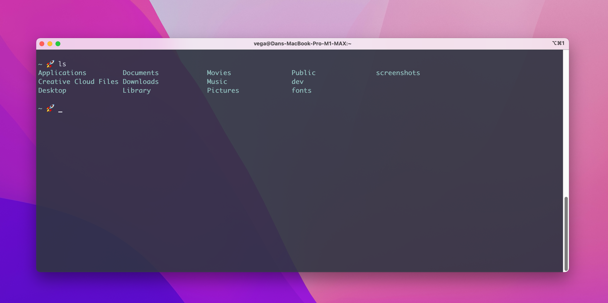

# MacBook Pro M1 Max (14-inch, 2021) Setup

I have been looking forward to getting this computer ever since the M1 was released in 2020. In this setup I will walk you through my process for setting up my new MacBook Pro. If you have any questions or suggestions please contact me or send me a pull request. The laptop I am setting up with this document is:

- MacBook Pro (14-inch, 2021)
- Chip: Apple M1 Max
- Memory 32GB

## Apple Care

If you haven't already purchased Apple Care what are you waiting for? You have 90 days but I wouldn't wait and now that you can basically pay $99 a year for Apple Care it's an easy choice.

If you have purchased it make sure you active it now. If you don't do it now its something you will quickly forget about and you don't want to. To check your support plan is in place you go to  `Apple > About This Mac > Support` and verify you coverage.
## Desk Setup

The first thing I did was set this up on my desk, connect my external monitors and hook up all of my peripherals:

 - [LG 4k Display](https://amzn.to/3C8IqQy)
 - [Dell UltraSharp U3415W 34-Inch Curved LED-Lit Monitor](https://amzn.to/3HcTobs)
 - [Apple Magic Keybaord](https://amzn.to/3quWxh0)
 - [Logitech MX Master 3 Mouse](https://amzn.to/3F2gLCy)
 - [Audio-Technica AT2020 USB Microphone](https://amzn.to/3HdoZto)
 - [Sony A6100 DSLR Camera](https://amzn.to/3Dk78P2)
 - [Elgato Cam Link 4k](https://amzn.to/3c4fpea)
 - [Elgato Key Light * 2](https://amzn.to/3HdpnIm)
 - [Apple AirPods Pro](https://amzn.to/3qvw3vO)
 - [Wyze Wireless Noise Cancelling Headphones](https://amzn.to/3F5Utjp)

## System Preferences

I have a few things that I customize in preferences:

**Mouse:**
`System Preferences > Mouse`
I update the tracking speed and scroll speed, I like to move fast.

**Trackpad:**
`System Preferences > Trackpad > Scroll & Zoom`:
I uncheck scroll direction: Natural (It doesn’t feel natural for me)

**Dock:**
`System Preferences > Dock`
Change the size to small and turn on magnification
I also remove all icons from the dock that I don't use

**Avatar:**
`System Preferences > Users & Groups > Edit Avatar`

**Theme:**
macOS Mojave introduced light & dark themes. If you want to change this later simply go to `System Preferences > General > Appearance`. I like the auto option will use the light theme during the day and the dark theme at night.

## macOS Updates

The first thing I do is run any updates that are available. In my case, the laptop came preloaded with macOS Monterey and there was a 12.0.1 update available. You can find these updates by going to `System Preferences > Software Updates`.

## App Store

This is a good time to check for any application updates or install any apps from the app store that you can't install via Homebrew.

*You might run into issues here because the apple id that downloaded them is not you. In this case I just removed those apps I am not using (GarageBand,Numbers,Pages,iMovie...)*

To remove applications I like installing [AppCleaner](https://freemacsoft.net/appcleaner/). This will make sure that the application and any related files will be removed. Another application I love for this and so many other things is [Clean My Mac](https://macpaw.com/cleanmymac). This application has a yearly subscription fee but worth the price tag.

### Garage Band

If you don't have a large hard drive and space is at a premium removing Garage Band will free up a bunch of it. Unfortunately, AppCleaner only works for 3rd party installed applications and won't remove GarageBand but Clean My Mac will.

If you need to remove this manually there are a few locations you need to remove. If you're going to use apple sound affects in other programs please read up on this before deleting it.

* /Applications/GarageBand.app
* /Library/Application Support/GarageBand/
* /Library/Audio/Apple Loops/Apple/

Empty Trash

## Finder

I like to customize Finder so I can get to all of my most used places quickly.

**Favorites**

* Add common folders to favorites
  * Home (Users/vega)
  * dev/
  * youtube/
* screenshots (configure screenshot utility to save here)
    * open screenshot > options > other location

**A few tips in finder**

* cmd+shift+h (takes you home)
* cmd . (show hidden files and folders)

### Install Apps

While I am in the App Store I take this opportunity to install any apps that I need that I can't install via Homebrew. This is my current list:

- Xcode
#### Manual Installations

- [Ecamm Live](https://www.ecamm.com/)
- [Elgato Controler Center](https://www.elgato.com/en/downloads)

## Getting Started

Anything I can install using [HomeBrew](https://brew.sh/) I will. Before you install HomeBrew though you need to install the Xcode command-line utilities. Open up a new terminal and type the following command. Even if you installed Xcode you still need to install these now as they moved them out of the standard installation.

```
xcode-select --install
```

The command-line Tools Package is a small self-contained package available for download separately from Xcode and that allows you to do command-line development in OS X. It consists of two components: OS X SDK and command-line tools such as Clang, which are installed in `/usr/bin`.

### HomeBrew

As I said earlier I use HomeBrew to install anything that it can install. If you normally use brew to install something like google-chrome you know that you have to then drag it into the applications folder. If you use cask it will not only download the package but also move it into the applications folder for you.

[HomeBrew Website](https://brew.sh/)

Installation:
/usr/bin/ruby -e "$(curl -fsSL https://raw.githubusercontent.com/Homebrew/install/master/install)"

## Shell

The default shell in macOS is now zsh. All this means is that the user account shell will default to zsh. This doesn't mean you can't use bash or whatever shell you want. In the past, I have switched this to bash but I have decided to stop being an old man who is stuck in his ways and switch over to zsh and oh-my-zsh.

 ### OH MY ZSH

If you're going to use ZSH you must start by installing [oh-my-zsh](https://ohmyz.sh/).

> Oh My Zsh is a delightful, open-source, community-driven framework for managing your Zsh configuration. It comes bundled with thousands of helpful functions, helpers, plugins, themes, and a few things that make you shout... "Oh My ZSH!"

This replaces the need for me to customize bash with all my aliases, shortcuts a personal preferences. Once you have oh-my-zsh installed you can switch themes and add plugins. I decided to install the [Spaceship theme](https://github.com/denysdovhan/spaceship-prompt) and here are the following plugins that I have activated.

```
plugins=(common-aliases git aws docker golang httpie node npm nvm spring)
```



### iTerm2

I switched from Terminal to iTerm2 a couple of years ago and haven't looked back. If you want to find out about some of the features & configurations it gives you please [check out their website](https://www.iterm2.com/features.html).

```
brew install --cask iterm2
```

One thing I like to do is customize the colors and a great resource for that is https://iterm2colorschemes.com/

This is a list of my favorite color schemes.

* Ayu Mirage
* Dracula
* FirefoxDev
* Github
* Hipster Green
* Homebrew
* Man Page
* Material
* MaterialDark
* Novel
* OceanicMaterial
* Nord

## Development Setup

Now that I have a clean and stylish command line full of features it's time to start installing all of the different applications I will use. If you have any questions about any of these or why I install them please see the contact me section below.

* brew install git
* brew install --cask google-chrome
* brew install --cask visual-studio-code
* brew install --cask intellij-idea
* brew install --cask docker
* brew install --cask tableplus
* brew install --cask lastpass
* brew install --cask rectangle
* brew install --cask kaleidoscope
* brew install --cask postman
* brew install --cask notion
* brew install --cask adobe-creative-cloud
* brew install --cask zoom
* brew install --cask krisp
* brew install tree
* brew install bat
* brew install httpie

### Chrome Plugins

With Google Chrome installed these are a few of my favorite plugins. Google Chrome has profiles now so if you have set one up you should be able to just sign in and get all of your bookmarks, plugins and settings. This is a really great feature when setting up a new computer.

- [Last Pass](https://chrome.google.com/webstore/detail/lastpass-free-password-ma/hdokiejnpimakedhajhdlcegeplioahd?hl=en)
- [Window Resizer](https://chrome.google.com/webstore/detail/window-resizer/kkelicaakdanhinjdeammmilcgefonfh?hl=en)
- [JSON Viewer](https://chrome.google.com/webstore/detail/json-viewer/gbmdgpbipfallnflgajpaliibnhdgobh?hl=en)
- [Vue DevTools](https://chrome.google.com/webstore/detail/vuejs-devtools/nhdogjmejiglipccpnnnanhbledajbpd?hl=en)
- [ColorZilla](https://chrome.google.com/webstore/detail/colorzilla/bhlhnicpbhignbdhedgjhgdocnmhomnp?hl=en)
- [Notion Web Clipper](https://chrome.google.com/webstore/detail/colorzilla/bhlhnicpbhignbdhedgjhgdocnmhomnp?hl=en)
- [Grammarly](https://chrome.google.com/webstore/detail/grammarly-for-chrome/kbfnbcaeplbcioakkpcpgfkobkghlhen?hl=en)

### Visual Studio Code

Visual Studio Code is my goto all-purpose text editor. VSCode recently added support for settings sync which allows you to sync all of your settings, themes, extensions across multiple devices. This makes setting up an instance of Visual Studio Code a snap. This is by no means a complete list but here are a few of my favorite settings that get synced.

You can turn on Settings Sync using the Turn On Settings Sync... entry in the Manage gear menu at the bottom of the Activity Bar.

#### Fonts

- [Hack](https://sourcefoundry.org/hack/)
- [Dank Mono](https://dank.sh/)
- [JetBrains Mono](https://www.jetbrains.com/lp/mono/)

#### Themes

- [Synthwave 84](https://github.com/robb0wen/synthwave-vscode)
- [Nord](https://github.com/arcticicestudio/nord-visual-studio-code)
- [In Bed By 7pm](https://github.com/sdras/inbedby7pm)
- [Colbolt2 Theme Official](https://github.com/wesbos/cobalt2-vscode)
- [Panda](https://github.com/tinkertrain/panda-syntax-vscode)
- [Horizon](https://github.com/jolaleye/horizon-theme-vscode)
#### Extensions

- [Java Extension Pack](https://marketplace.visualstudio.com/items?itemName=vscjava.vscode-java-pack)
- [Spring Boot Extension Pack](https://marketplace.visualstudio.com/items?itemName=Pivotal.vscode-boot-dev-pack)
- [Go](https://marketplace.visualstudio.com/items?itemName=golang.Go)
- [Docker](https://marketplace.visualstudio.com/items?itemName=ms-azuretools.vscode-docker)
- [Markdown All in One](https://marketplace.visualstudio.com/items?itemName=yzhang.markdown-all-in-one)
- [Grammarly (unofficial)](https://marketplace.visualstudio.com/items?itemName=znck.grammarly)
- [GitLens](https://marketplace.visualstudio.com/items?itemName=eamodio.gitlens)
- [Auto Close Tag](https://marketplace.visualstudio.com/items?itemName=formulahendry.auto-close-tag)
- [Bracket Pair Colorizer](https://marketplace.visualstudio.com/items?itemName=CoenraadS.bracket-pair-colorizer)
- [Live Server](https://marketplace.visualstudio.com/items?itemName=ritwickdey.LiveServer)
- [NPM](https://marketplace.visualstudio.com/items?itemName=eg2.vscode-npm-script)
- [Tailwind CSS IntelliSense](https://marketplace.visualstudio.com/items?itemName=bradlc.vscode-tailwindcss)
- [Vue Language Features - Volar](https://marketplace.visualstudio.com/items?itemName=johnsoncodehk.volar)
- [Open Folder Context Menus](https://marketplace.visualstudio.com/items?itemName=chrisdias.vscode-opennewinstance)

### Node & NPM

If you're going to install Node I think the best way to do so is by using [Node Version Manager (NVM)](https://github.com/creationix/nvm). This to me has a few advantages over installing it from brew or even directly downloading it from their website.

* You can install multiple versions of Node
    * You can set a default version
    * You can switch between these versions easily
* Installs in your home directory
    * You don't need special privileges
    * No more sudo when installing packages globally

Once you have NVM you can install the latest stable release (v10.12.0 at the time of this writing) using the following command.

```
nvm install stable
```

#### Global Packages to Install

npm install -g tldr
npm install -g typescript
npm install -g eslint
npm install -g lodash

### Git Config

There is usually a default install of git but we used brew to install the latest earlier. Now that we are on the latest version of git we need to do a little configuration. If you run the following commands they will be written to `.gitconfig`:

* git config --global user.email "danvega@gmail.com"
* git config --global user.name "Dan Vega"

Next, you need to generate an ssh key and add the key to your provider account. I am using Github and they happen to have some great documentation on everything ssh.

https://docs.github.com/en/github/authenticating-to-github/connecting-to-github-with-ssh

### SDKMan

This is one of my favorite version managers because I use a lot of the Software Development Kits (SDKs) it manages. If you haven't heard of [SDKMan check them out here](https://sdkman.io/install). This is a list of SDKs I manage using SDKMan.

* Java
* Groovy
* Grails
* Gradle
* Maven
* Micronaut
* Spring Boot
* Kotlin

Here is a full list of SDKs https://sdkman.io/sdks

**Installation:** curl -s "https://get.sdkman.io" | zsh

If you just type SDK install candidate it will install the latest stable version or you can install a specific version

```
sdk install java 15.0.1.hs-adpt
```

If you need to get a list of versions you can ask for it:

```
sdk list java
```

There is also a [Sdkman Zsh Plugin](https://github.com/matthieusb/zsh-sdkman) that will give you some autocompletion.

### Adobe Creative Suite

I am a big fan of Adobe and all of their products! I have a subscription to the creative cloud and I installed that earlier using HomeBrew. I will open up the creative cloud tool and install the following products:

* Photoshop
* Illustrator
* Premiere Pro
* After Effects
* Premiere Rush
* XD

## Contact Me

If you have any questions about anything I am using or have suggestions for something I am missing please don't hesitate to reach out. You can find me on my website at http://www.therealdanvega.com or send me an email to danvega@gmail.com. I also have a [uses page](https://www.danvega.dev/uses/) where you can find out more about my setup.
